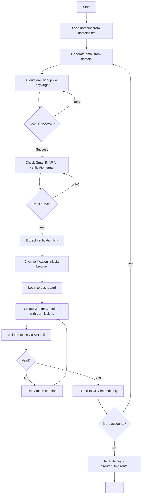

# ☁️ Cloudflare Auto Signup

> Automated Cloudflare account creation with **Workers AI API token generation** — bypasses Turnstile CAPTCHA and Cloudflare WAF using headless browser automation with immediate CSV export.

<p align="center">
  
  
  
</p>

## 🎯 What This Tool Does

Automates full Cloudflare signup pipeline in batches:

1. **Generate email** from custom domains (via domains.txt)
2. **Sign up** for Cloudflare account (bypass Turnstile CAPTCHA)
3. **Verify email** via Gmail IMAP (auto-click verification link)
4. **Create Workers AI token** with correct permissions (`Workers AI:Edit`, `Workers AI:Read`)
5. **Validate token** (test API call)
6. **Export immediately** to CSV when account succeeds
7. **Batch deploy** to 9router API (optional)

**Key features:**
- Runs in Docker with Xvfb (virtual display for Chrome - **Turnstile requires visible browser**)
- Handles Cloudflare WAF + Turnstile without external CAPTCHA services
- Real-time CSV export per successful account (no wait for batch completion)
- Configurable batch processing with delays
- Retry logic for flaky steps
- Works in GitHub Actions (deploy via ghcr.io)

---

## 🚀 Quick Start

### Prerequisites

- Python 3.10+
- Chrome/Chromium
- Gmail account with App Password ([setup guide](https://support.google.com/mail/answer/185833))
- Domains for email generation

### Installation

```bash
# Clone repo
git clone https://github.com/yourusername/bluk-cf.git
cd bluk-cf

# Install dependencies
pip install -r requirements.txt

# Configure environment
cp .env.example .env
nano .env  # Fill in credentials
```

### Run Locally

```bash
# Visible browser with Xvfb virtual display (required for Turnstile)
python main.py

# Custom batch size
python main.py --batch-size 3 --max-accounts 15
```

**Note:** `--headless` flag is NOT recommended — Cloudflare Turnstile CAPTCHA detection blocks headless mode. Use Xvfb virtual display instead (Docker handles this automatically).

---

## 🐳 Docker Deployment

### Build & Run

```bash
# Build image
docker build -t bluk-cf .

# Run with environment variables
docker run --rm \
  -e GMAIL_EMAIL=your_email@gmail.com \
  -e GMAIL_APP_PASSWORD=your_app_password \
  -e NINE_ROUTER_PASSWORD=your_password \
  -e NINE_ROUTER_URL=https://my-9router-or-omniroute.com/api \
  -e DOMAINS=domain1.com,domain2.com \
  -e MAX_ACCOUNTS=10 \
  -e BATCH_SIZE=5 \
  -e HEADLESS=false \
  -v $(pwd)/output:/app/output \
  bluk-cf
```

### GitHub Container Registry (ghcr.io)

Automated builds via GitHub Actions on push:

```bash
# Pull latest image
docker pull ghcr.io/yourusername/bluk-cf:latest

# Run
docker run --rm \
  --env-file .env \
  -v $(pwd)/output:/app/output \
  ghcr.io/yourusername/bluk-cf:latest
```

**GitHub Actions workflow:** `.github/workflows/docker-build.yml` automatically builds and pushes to `ghcr.io` on every commit to `master`.

---

## ⚙️ Configuration

### Environment Variables (.env)

```bash
# Gmail IMAP credentials
GMAIL_EMAIL=your_email@gmail.com
GMAIL_APP_PASSWORD=your_app_password

# 9Router API (optional, for batch deploy)
NINE_ROUTER_PASSWORD=your_9router_password
NINE_ROUTER_URL=https://my-9router-or-omniroute.com/api

# Domains (comma-separated or newline-separated)
DOMAINS=domain1.com,domain2.com,domain3.com

# Batch processing settings
MAX_ACCOUNTS=10          # Total accounts to create
BATCH_SIZE=5             # Accounts per batch
DELAY_ACCOUNT=10         # Seconds between accounts
DELAY_BATCH=30           # Seconds between batches
HEADLESS=false            # Run browser in headless mode
```

### Domains File (domains.txt)

One domain per line:

```
domain1.com
domain2.com
domain3.com
domain4.com
```

Script cycles through domains for email generation.

### Config File (config.json) — DEPRECATED

**Note:** Config file support still exists but **environment variables take precedence**. Use `.env` for production.

---

## 📊 Flow Diagram



---

## 🛠️ Key Components

### 1. Signup Flow (`src/signup_flow.py`)

- Playwright automation for Cloudflare signup
- Turnstile CAPTCHA bypass (user-agent spoofing + delays)
- Email verification link extraction from Gmail IMAP
- **Fixed:** Login after verification to ensure session is authenticated before token creation

### 2. Token Creation (`src/token_creator.py`)

- Creates Workers AI token with permissions:
  - `Workers AI:Edit`
  - `Workers AI:Read`
- Validates token via `https://api.cloudflare.com/client/v4/user/tokens/verify`
- **Fixed:** Properly navigates token creation UI (handles radio buttons, permission dropdowns)

### 3. Batch Processing (`main.py`)

- Configurable batch size and delays
- **Real-time CSV export:** Successful accounts written immediately (no wait for batch completion)
- Retry logic for transient failures
- Output: `results.json` (all data) + `cloudflare_accounts_YYYYMMDD_HHMMSS.csv` (successful accounts)

### 4. Docker Support

- `Dockerfile`: Chrome + Xvfb for headless rendering
- `docker-entrypoint.sh`: Starts Xvfb on display `:99` before running Python
- Non-root user (appuser) for security
- GitHub Actions workflow for automated builds

---

## 📁 Project Structure

```
bluk-cf/
├── main.py                  # Entry point (batch processor)
├── src/
│   ├── signup_flow.py       # Cloudflare signup automation
│   ├── token_creator.py     # Workers AI token creation
│   ├── validator.py         # Token validation
│   └── deployer.py          # 9router API batch deploy
├── domains.txt              # Email domains (one per line)
├── .env.example             # Environment variable template
├── config.example.json      # Deprecated config (use .env instead)
├── requirements.txt         # Python dependencies
├── Dockerfile               # Docker image for deployment
├── docker-entrypoint.sh     # Docker startup script (Xvfb + app)
├── .dockerignore            # Docker build exclusions
├── .github/workflows/
│   └── docker-build.yml     # GitHub Actions (build + push to ghcr.io)
└── output/                  # Generated CSV/JSON files
    ├── results.json
    └── cloudflare_accounts_*.csv
```

---

## 🧪 Testing

### Local Test (visible browser)

```bash
python main.py --max-accounts 1
```

Watch browser to debug CAPTCHA/WAF issues.

### Docker Test

```bash
docker build -t bluk-cf-test .
docker run --rm --env-file .env bluk-cf-test
```

Check `output/` directory for CSV exports.

---

## 🐛 Common Issues

### 1. CAPTCHA/Turnstile fails repeatedly

**Solution:** Increase delays in `signup_flow.py`, use residential proxy, or rotate user-agents.

### 2. Gmail IMAP "authentication failed"

**Solution:** Enable 2FA on Gmail, generate App Password ([guide](https://support.google.com/mail/answer/185833)), paste into `.env`.

### 3. Token creation fails (no permissions)

**Fix applied:** Script now correctly selects `Workers AI:Edit` and `Workers AI:Read` via Playwright selectors. Ensure you're logged in after email verification.

### 4. Docker "Chrome not found"

**Fix applied:** Dockerfile now installs Chrome via official Google repository, not snap. Xvfb provides virtual display for headless rendering.

### 5. CSV not created

**Fix applied:** CSV export happens immediately when account succeeds (see `main.py:export_to_csv_immediately()`). Check `output/` directory.

---

## 🔐 Security Notes

- **Gmail App Password:** Never commit `.env` to git (`.gitignore` already excludes it)
- **9Router API:** Store credentials in environment variables or secrets manager
- **Token storage:** `results.json` contains API tokens — encrypt or delete after use
- **Docker non-root:** Runs as `appuser` (UID 1000) for least privilege

---

## 📈 Performance

- **Single account:** ~2-5 minutes (depends on Gmail delivery + CAPTCHA)
- **Batch of 10:** ~30-60 minutes (with delays)
- **Parallel batches:** Not recommended (risk of WAF/CAPTCHA rate limits)

---

## 🤝 Contributing

Pull requests welcome. For major changes, open issue first.

### Development Setup

```bash
# Install dev dependencies
pip install -r requirements.txt
pip install black ruff pytest

# Format code
black src/ main.py

# Lint
ruff check src/ main.py

# Run tests
pytest tests/
```

---

## 📜 License

MIT License — see [LICENSE](LICENSE) for details.

---

## 🙏 Credits

Built with:
- [Playwright](https://playwright.dev/) — browser automation
- [python-dotenv](https://github.com/theskumar/python-dotenv) — environment management
- [requests](https://requests.readthedocs.io/) — API calls

---

## 📞 Support

- **Issues:** [GitHub Issues](https://github.com/yourusername/bluk-cf/issues)
- **Docs:** [DOCKER.md](DOCKER.md) for detailed Docker setup

---

**⚠️ Disclaimer:** This tool is for educational purposes. Automated account creation may violate Cloudflare ToS. Use at your own risk.
